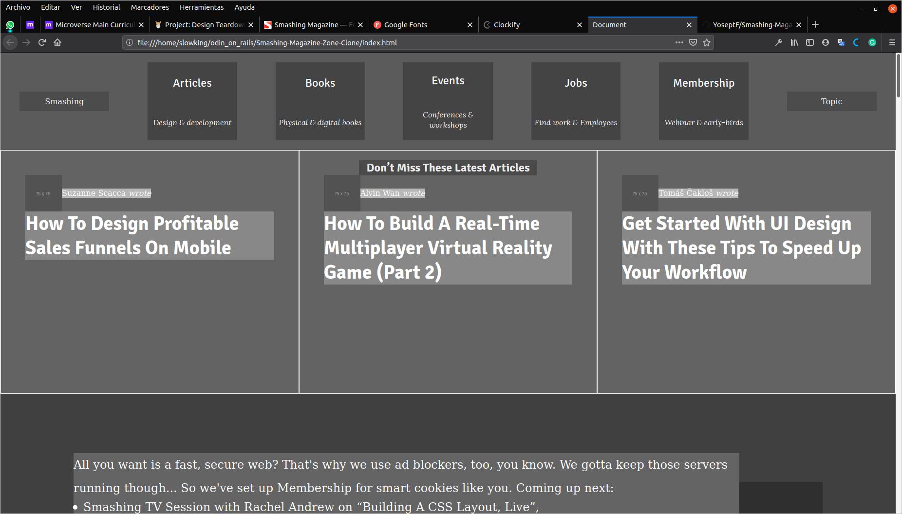

# Design Teardown

> This project consists of building a heatmap of the Smashing magazine website.

## Details  

### Nav Bar 
- The navbar was made using a *flexbox* and all the items inside were automatically aligned with `<align-items>` and `<justify-content>` properties.

### Section

- This section was made using *Grid* and *Media Queries*. On max screen size it will show only three tiles, then it will crop to two columns and two rows showing a total of four tiles and finally it will show only one column and four rows. The page is fully responsive.

- The elements inside are aligned using *flexboxes*.

### Block colors
- To choose the colors we checked the first thing that catched our eye. This happened mainly with the contaniers and not its actual content so we got to the conclusion that the page put more effort on the layout than in the articles.

## Built With

- HTML5, CSS3
- VSCode

## Live Demo
You can check the live version here:

## Authors

👤 **Joseph Flores**
- Github: [@YoseptF](https://github.com/YoseptF)
- Twitter: [@Yosept__](https://twitter.com/Yosept__)
- Linkedin: [Joseph Flores](https://www.linkedin.com/in/joseph-flores-928505106/)

👤 **Diego Luna Granados**
- Github: [@SlowKingV](https://github.com/SlowKingV)
- Twitter: [@SlowKingVI](https://twitter.com/SlowKingVI)
- Linkedin: [Diego Luna Granados](https://www.linkedin.com/in/diego-luna-granados-64007b197/)
